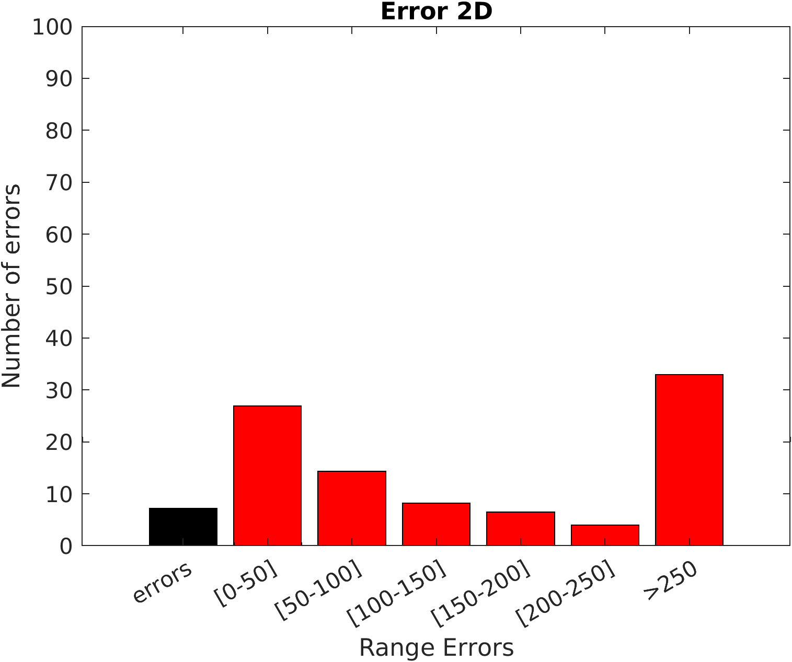
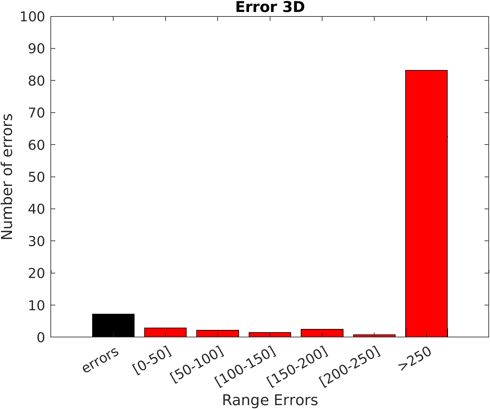
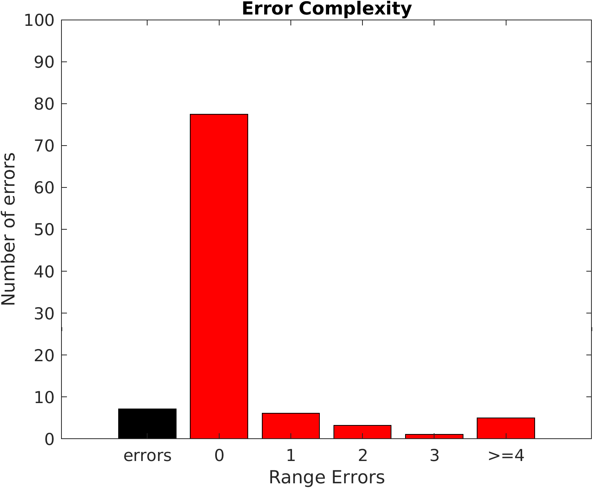

# Exercise 1

#### 👨‍🎓 This project was carried out during my master's degree in computer vision at URJC - Madrid

We want to compare the results obtained by a 3D object recognition algorithm.

## Goals

- Generate a graph with the 2D Area.
- Generate a graph with the 3D Area.
- Generate a graph with the Complexity.

## Requirements

* Matlab

## Usage

Run ```Graph_generation.m``` with matlab

## Results

<p align="center">
  
</p>
<p align="center">
  <i>Result of the 2D area graph</i>
</p>

<p align="center">
  
</p>
<p align="center">
  <i>Result of the 3D area graph</i>
</p>

<p align="center">
  
</p>
<p align="center">
  <i>Result of the complexity graph</i>
</p>

## Structure

    .
    ├── datasets
    │    ├── detection.csv
    │    └── groundtruth.csv
    ├── error2D.png
    ├── error3D.png
    ├── errorcomplexity.png
    ├── Graph_generation.m
    └── README.md

## Authors

* **Luis Rosario** - *Initial work* - [Luisrosario2604](https://github.com/Luisrosario2604)