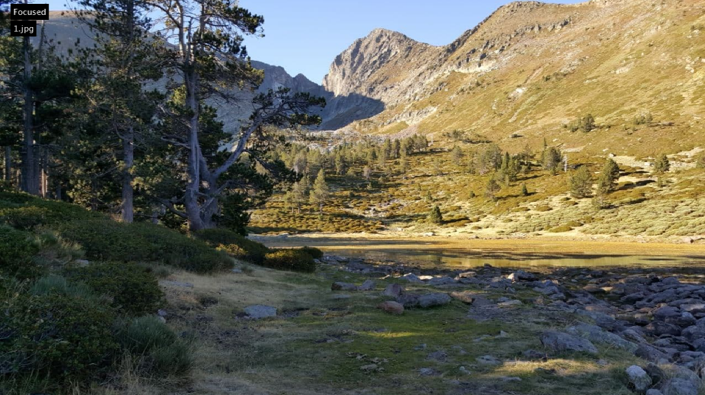

# Exercise 2

#### 👨‍🎓 This project was carried out during my master's degree in computer vision at URJC - Madrid

We want to know if an image is focus or not

## Goals

- Generate blurred images
- Detect if the image is focused or not (blur)

## Requirements

* Matlab

## Usage

Run ```Graph_generation.m``` with matlab

Functions :

- ```blurrer(image_dir_path, output_dir_path)``` will generate blurred images
- ```blurdetection(image_dir_to_detect_path, threshold)``` will detect if an image is focused or not

## Keys

- 'Space' to skip images

## Results

<p align="center">
  
</p>
<p align="center">
  <i>Result of a focused image</i>
</p>

<p align="center">
  
</p>
<p align="center">
  <i>Result of a blurred image</i>
</p>

## Structure

    .
    ├── all_images
    │    └── *.jpg
    ├── detect_blur.m
    ├── images_blurred
    │    └── *.jpg
    ├── images_originals
    │    └── *.jpg
    ├── imgs
    │    ├── result1.png
    │    └── result.png
    └── README.md

## Authors

* **Luis Rosario** - *Initial work* - [Luisrosario2604](https://github.com/Luisrosario2604)