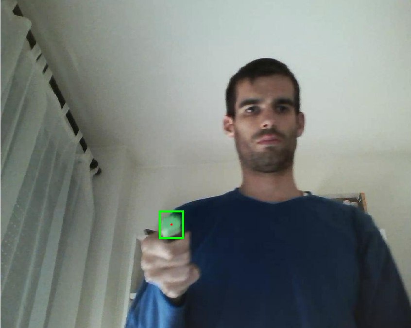

# Exercise 3

#### 👨‍🎓 This project was carried out during my master's degree in computer vision at URJC - Madrid

Artificial vision system that allows visual tracking by colour.
The system must be able to detect the object (if present) in each frame.

## Goals

- Apply a Gaussian filter to the frame to remove noise.
- Convert frame to HSV colour space
- Segment the frame using the selected colour range
- Remove noise in the resulting image
- Detect the different contours that appear in the image and keep the one that has the largest area

## Requirements

* Matlab

## Usage

Run ```tracking.m``` with matlab

## Results

<p align="center">
  
</p>
<p align="center">
  <i>Result of the visual color tracking (1 frame)</i>
</p>

## Structure

    .
    ├── imgs
    │    └── result.png
    ├── lapiz.avi
    ├── README.md
    ├── readme.txt
    └── tracking.m

## Authors

* **Luis Rosario** - *Member 1* - [Luisrosario2604](https://github.com/Luisrosario2604)