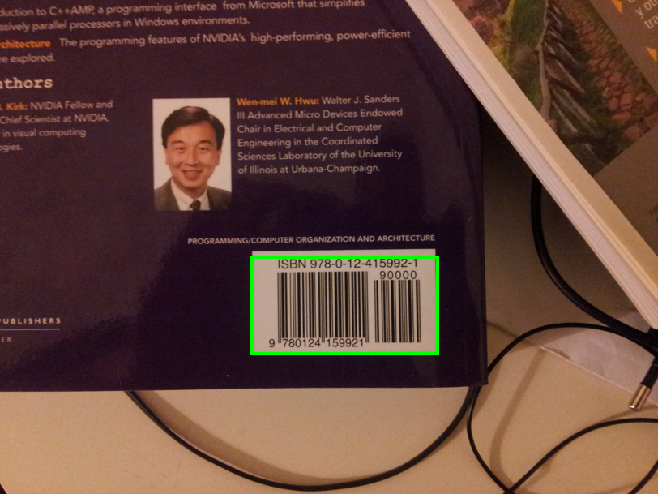
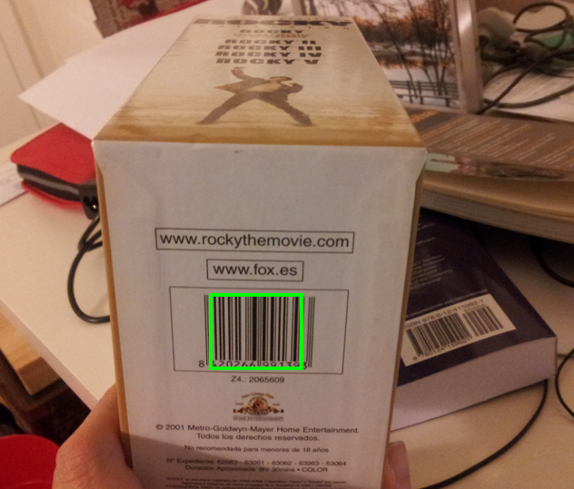

# Exercise 4

#### 👨‍🎓 This project was carried out during my master's degree in computer vision at URJC - Madrid

Bar Code Detector

## Goals

- Detect the barcodes

## Requirements

* Matlab

## Keys

- 'Space' to skip images

## Usage

Run ```detect_barcodes.m``` with matlab

## Results

<p align="center">
  
</p>
<p align="center">
  <i>First bar code detection</i>
</p>

<p align="center">
  
</p>
<p align="center">
  <i>Second bar code detection</i>
</p>

## Structure

    .
    ├── barcodeimages
    │    ├── barcode1.jpg
    │    ├── barcode2.jpg
    │    ├── barcode3.jpg
    │    ├── barcode4.jpg
    │    ├── barcode5.jpg
    │    └── barcode6.jpg
    ├── detect_barcodes.m
    ├── imgs
    │    ├── result1.png
    │    └── result.png
    └── README.md

## Authors

* **Luis Rosario** - *Initial work* - [Luisrosario2604](https://github.com/Luisrosario2604)